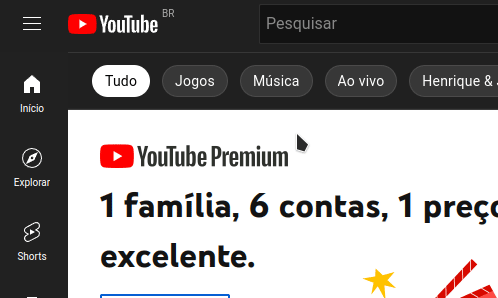
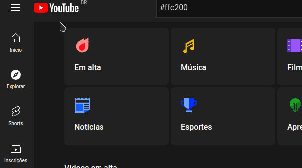
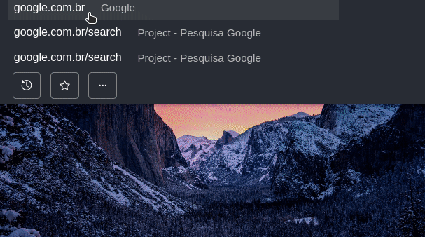

# My Min Browser userscripts collection

This is my collection of userscripts for Min Browser, feel free to contribute too. Usually these scripts also work in browsers or extensions that support userscripts, not just in the min browser.

# Scripts

## Utilities 

### Reload Page

Add a simple "reload page" button on context-menu (right-click on mouse).

[-> Download here <-](./userscripts/ReloadPage.js)

### Color Picker

Native color picker tools with input type="color" element.

[-> Download here <-](./userscripts/ColorPicker.js)

## Fun things

### All images are trolls

Can you imagine a friend turns on the computer to research a school project and notices that all the images on all the sites are troll faces? It is also possible to easily substitute for any image you are interested in, just by changing the url in the script.

[-> Download here <-](./userscripts/AllImageAreTrolls.js)

# How to use
[Minbrowser Wiki - Userscripts](https://github.com/minbrowser/min/wiki/userscripts)

# Contributing Code
Just [fork the repository](https://github.com/mblithium/my-min-userscripts-collection/fork), create your script and make a pull request, with the new script and explaining step-by-step how it works (if it's too long or complicated).
